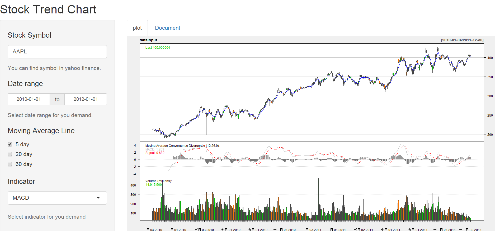

##Summary

This is homework for Developing Data Products lesson. I created a Shiny application and deploy it on Rstudio's servers.This Shiny application can show stock trend and technology indicator with the quantmod package.The stock data come from yahoo finance.You can find the stock symbol from [yahoo finance](http://finance.yahoo.com/stock-center/),and key in stock symbol finance field.The shiny application will show you stock trend chart.Then you can select the indicator for you want. I think this shiny application is easy to use. I hope you will like it.

##Design

###Layout 

The shiny application uses fluid page with sidebar layout.The sidebar has text input, date range input, checkbox group input, and select input widget to set stock symbol, date range, EMA  ,and another indicator,and has help text widget to explain the method.The main page inserts tabset panel that has two tab panel for plot and supporting documentation.

```{r, eval=FALSE}
library(shiny)

shinyUI(fluidPage(

  # Application title
  titlePanel("Stock Trend Chart"),

  # Sidebar with a slider input for number of bins
  sidebarLayout(
    sidebarPanel(
      #input sotck symbol
      textInput("ID_text", 
                label = h4("Stock Symbol"), 
                value = "AAPL"),
      helpText("You can find symbol in yahoo finance."),
      # set data range
      dateRangeInput("dates", 
                     label = h4("Date range"),
                     start="2010-01-01",
                     end="2012-01-01"),
      helpText("Select date range for you demand."),
      # set EMA
      checkboxGroupInput("ma", label = h4("Moving Average Line "), 
                         choices = list("5 day" = 1, "20 day" = 2, "60 day" = 3),
                         selected = 1),
      # select indicator
      selectInput("ta", label = h4("Indicator"), 
                  choices = list("MACD" = 1, "WMI" = 2, "RSI" = 3), 
                  selected = 1),
      helpText("Select indicator for you demand"),
      # set sidebar layout size
      width=3
     
    ),

    # Show a plot of the generated distribution and support document
    mainPanel(
      tabsetPanel(
        # show a plot 
        tabPanel(
          "plot",plotOutput("Plot",, width = "100%", height = "500px")
        ),
        # show support document
        tabPanel(
          "Document"
        )
      ),
      # set sidebar layout size
      width = 9
    )
  )
))

```


###Server


The server handle to get stock data and plot chart. First, we set techno. indicator list from UI input$ma and input$ta variable, and get stock data from yahoo finance with getSymbols function. Finally , we plot stock chart with chartSeries function.  

```{r, eval=FALSE}
library(shiny)
library(quantmod)

#indicator list
mastring<-c("addEMA(n=5)","addEMA(n=20)","addEMA(n=60)")
tastring<-c("addMACD()","addWPR()","addRSI()")

shinyServer(function(input, output) {
  # add indicator 
  ta<-reactive({
    baseta<-"addVo()"
    ma<-paste(mastring[as.numeric(input$ma)],collapse=";")
    baseta<-paste(baseta,ma,sep=";")
    baseta<-paste0(tastring[as.numeric(input$ta)],";",baseta)
  })
  # get stock data from yahoo finance  
  datainput<-reactive({
    symbol_env <- new.env()
    stock <- require_symbol(input$ID_text,input$dates[1],input$dates[2],symbol_env)
  })
  #plot stock chart
  output$Plot <- renderPlot({
    
    chartSeries(datainput(),theme="white",type ="candlesticks", TA=ta()) 
    
  })

})
# get stock data function
require_symbol <- function(symbol,start,end,envir = parent.frame()) {
  if (is.null(envir[[symbol]])) {
    envir[[symbol]] <- getSymbols(symbol,from =start,to =end,auto.assign = FALSE)
  }
  
  envir[[symbol]]
}

```

##Example

This example show Apple Inc. stock trend from 2010/1/1 to 2012/1/1 with 5 day EMA and MACD indictor.



##Homework deploy path
 
  - [Shinyapp Path](https://ghl0506.shinyapps.io/ShinyWork/)

  - [Github path](https://github.com/Ghun-Hun/ShinyWork)

  - [Presentation Path](http://rpubs.com/ghl0506/shinyapp)