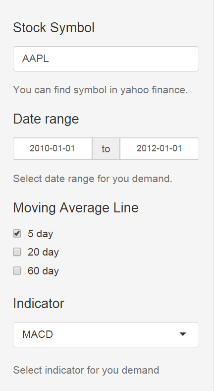
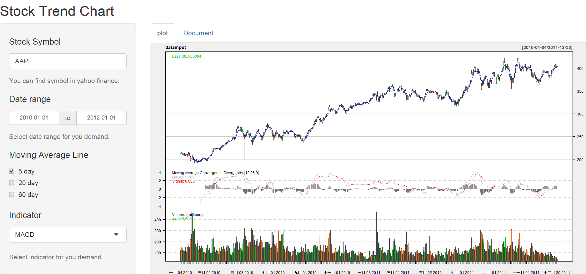

Course Project: Shiny Application and Reproducible Pitch
========================================================
author: Ghun Hun Liu
date: 2016/2/12
width: 1300
height: 800


Summary
========================================================


This is homework for Developing Data Products lesson. I created a Shiny application and deploy it on Rstudio's servers.This Shiny application can show stock trend and technology indicator with the quantmod package.The stock data come from yahoo finance.You can find the stock symbol from [yahoo finance](http://finance.yahoo.com/stock-center/),and key in stock symbol finance field.The shiny application will show you stock trend chart.Then you can select the indicator for you want. I think this shiny application is easy to use. I hope you will like it.

 **Homework deploy path**
 
  -[Shinyapp Path](https://ghl0506.shinyapps.io/ShinyWork/)

  -[Github path](https://github.com/Ghun-Hun/ShinyWork)

  -[Presentation Path](http://rpubs.com/ghl0506/shinyapp)

Design - Layout
========================================================
left: 70%
**fluid page**
--------------------------------------------------------

 - Sidebar panel
  
    - textInput widget: set stock symbol
    - dataRangeInput widget: set date range 
    - checkboxGroupInput widget: set EMA for 5,20,60 days
    - selectInput widget: select indicator 
    - helpText widget: help text

 - Main panel
  
    - tabsetPanel widget
      - plot tabPanel: plot chart for stock trend
      - Document tabPanel: support document
      
***   



Design Server
========================================================
- set indicator list

```r
> ta<-reactive({baseta<-"addVo()"
+ ma<-paste(mastring[as.numeric(input$ma)],collapse=";")
+ baseta<-paste(baseta,ma,sep=";")
+ baseta<-paste0(tastring[as.numeric(input$ta)],";",baseta) })
```
- get stock data form yahoo finance

```r
> datainput<-reactive({symbol_env <- new.env()
+ stock <- require_symbol(input$ID_text,input$dates[1],input$dates[2],symbol_env)})
```
- plot stock chart

```r
> output$Plot <- renderPlot({chartSeries(datainput(),theme="white",type ="candlesticks", TA=ta()) })
```

Example
========================================================

This example show Apple Inc. stock trend from 2010/1/1 to 2012/1/1 with 5 day EMA
 and MACD indictor.
 

